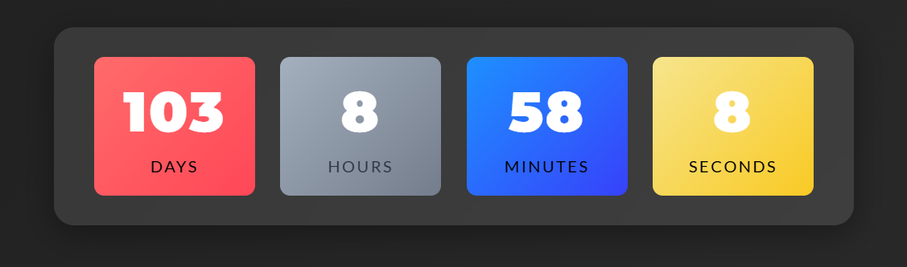

# Notion Widgets

[](https://github.com/prashantsaini1525)

Custom-built widgets designed specifically for enhancing your Notion workspace – featuring a dynamic timetable for streamlined scheduling and improved productivity.

---

## ✨ Features

- **Custom Timetable Widget:** Easily manage your daily schedule in Notion.
- **Seamless Integration:** Designed to integrate effortlessly into your Notion workspace.
- **Productivity Boost:** Optimize task management and time allocation.
- **User-Friendly:** Simple, intuitive, and visually appealing design.

---

## 🚀 Demo

<p align="center">
  
  
</p>

---

## 📥 Installation

1. **Clone the Repository:**

   ```bash
   git clone https://github.com/prashantsaini1525/notion-widgets.git
   cd notion-widgets
   ```

---

2. **Follow the Setup Guide:**

   Refer to the Installation Guide for detailed instructions on integrating these widgets into your Notion workspace.

---

## 🔧 Usage

- **Configure Widget Settings:**  
  Modify the provided configuration file to set up your widget as desired.

- **Embed in Notion:**  
  Follow the given instructions to embed the widget into your Notion page.

- **Customize Timetable:**  
  Adjust the timetable view to suit your scheduling needs.
